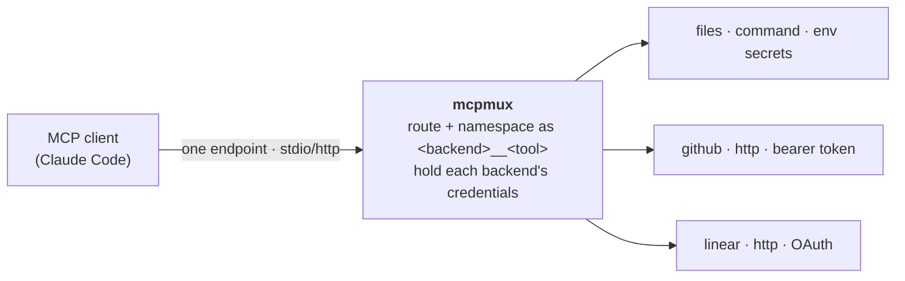

<!--
SPDX-FileCopyrightText: 2026 Thomas Bechtold <thomasbechtold@jpberlin.de>
SPDX-License-Identifier: Apache-2.0
-->

# mcpmux

A minimal **Model Context Protocol (MCP) multiplexer**. It connects to several
upstream MCP servers ("backends"), merges their tools under namespaced
`<backend>__<tool>` names, and re-exposes them through a **single MCP endpoint**
(stdio or streamable HTTP). The client (e.g. Claude Code) authenticates **once to
mcpmux**; mcpmux holds each backend's credentials and routes calls to the right
backend.

## Architecture



One inbound MCP server fans out to one client session per backend. Tool names get
a `<backend>__` prefix to avoid collisions; calls are forwarded verbatim to the
owning backend. A backend that fails to connect never takes down the proxy: it is
retried in the background and registers its tools whenever it comes up, and logs
go to stderr so stdout stays clean for the stdio transport.

## Features

- **Listen transport:** `stdio` or streamable `http`.
- **Backend transports:** `command` (subprocess over stdio; secrets via `env`) or
  `http` (streamable HTTP).
- **Backend auth** (http):
  - `none` / `bearer` (static token) / `header` (custom header + value).
  - `command` — a credential helper whose stdout is the bearer token; cached and
    re-run only near expiry (JWT `exp` honored; `ttl` caps opaque tokens) or on a
    401/403. No browser, e.g. `chainctl auth token --audience <resource>`.
  - `oauth` — interactive authorization-code + PKCE with dynamic client
    registration (RFC 7591); a browser opens once at startup, tokens refresh in
    memory. Options: `scopes`, `client_name`, `open_browser`, `callback_port`.
- **Self-healing connects** — a backend that fails at startup (an expired
  credential, an upstream still booting) is retried with jittered, capped
  backoff and registers its tools whenever it comes up; `SIGUSR1` retries every
  pending backend at once, so refreshing a credential needs no restart and no
  repeat of the interactive OAuth consents. Tunable under `connect_retry`.
  A dropped session is likewise reconnected, keeping the same tool catalog.
- **systemd socket activation** — the socket survives service restarts, so clients
  never hit "connection refused"; the service can run always-on or start on demand.
- **Not yet:** persisting OAuth tokens across restarts, aggregating resources or
  prompts (tools only), and authenticating the client→mcpmux hop (run it on
  localhost or behind your own auth proxy).

## Usage

Install:

```sh
go install github.com/toabctl/mcpmux@latest   # or: make build
```

Configure — copy `mcpmux.example.yaml` and edit. `${ENV_VAR}` references are
expanded at load time, so secrets stay out of the file. The config is searched in
order (first match wins; override with `-c`): `./mcpmux.yaml`,
`$XDG_CONFIG_HOME/mcpmux/config.yaml`, `$XDG_CONFIG_HOME/mcpmux.yaml`.

Run:

```sh
mcpmux serve -c mcpmux.yaml      # run the proxy
mcpmux list  -c mcpmux.yaml      # print the aggregated tool catalog
```

Use from Claude Code (http):

```sh
claude mcp add --transport http mcpmux http://127.0.0.1:8080/mcp
```

Remove the individual servers you folded into mcpmux so their tools don't appear
twice. For a `stdio` endpoint, let Claude Code launch it instead:
`claude mcp add mcpmux -- mcpmux serve -c /path/to/mcpmux.yaml`.

Run as a daemon (recommended) — `make install` installs the binary plus the
`.service` and `.socket` units, then:

```sh
systemctl --user enable --now mcpmux.socket mcpmux.service
```

See the comments in `dist/mcpmux.service` and `dist/mcpmux.socket` for the
always-on vs on-demand modes and the OAuth-at-startup setup.

## License

[Apache-2.0](LICENSE) © Thomas Bechtold
